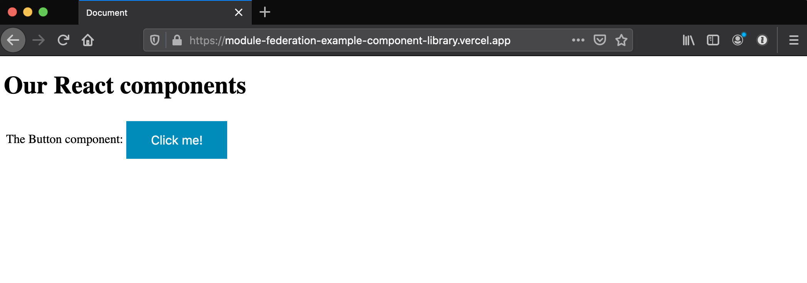
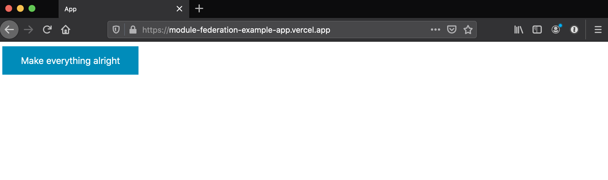
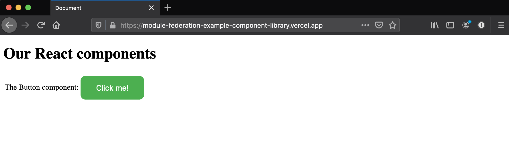
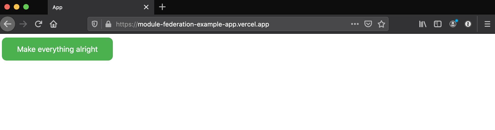

# The module federation example

This repo showcases the module federation available in Webpack 5.

Imagine that one team is working on a component library. The repository is located at https://github.com/mvasin/module-federation-example-component-library, the latest component showroom is available at https://module-federation-example-component-library.vercel.app/.

Imagine there are multiple teams using this component library, and we want to make sure all the teams use the latest version of the library. We also don't want to redeploy every app on every library release. Thanks to module federation, it's now possible! Check out this repo and the live demo at https://module-federation-example-app.vercel.app/

## How to test
1. Observe the component library showroom at https://module-federation-example-component-library.vercel.app/. It has a blue button with sharp corners. 
2. Observe the app https://module-federation-example-app.vercel.app/ which loads React components from the library at runtime - check out the network tab and notice requests to module-federation-example-component-library.vercel.app. It works because the library exposes selected modules via remote entry point https://module-federation-example-component-library.vercel.app/remoteEntry.js which is set up in the [library webpack config](https://github.com/mvasin/module-federation-example-component-library/blob/master/webpack.config.js). 
3. Now let's assume you're the library maintainer. You have no idea which apps use you library, and decided to tweak the button. Of course, the changes you make should be backwards compatible. Edit https://github.com/mvasin/module-federation-example-component-library/blob/master/src/Button.jsx - change `style={style1}` to `style={style2}` right in the GitHub interface. In a few seconds Vercel will deploy the new library showroom to https://module-federation-example-component-library.vercel.app/, with the updated button. 
4. As soon as the new version of the component library has been deployed, open the app https://module-federation-example-app.vercel.app/ and observe that the button in the app is also green and has rounded corners. _Without_ the redeployment of the application. Crazy! 

To follow these exact steps, you need access to the repo, of course, but feel free to clone and tweak Vercel URLs in the webpack configs of both the library and the app.

## Thanks
Massive shout-out to [@ScriptedAlchemy](https://github.com/ScriptedAlchemy) for module federation, the game changer in microfrontends! Also huge thanks to [@jherr](https://github.com/jherr) for the video series on the topic, without those I wouldn't be able to come up with this demo.
